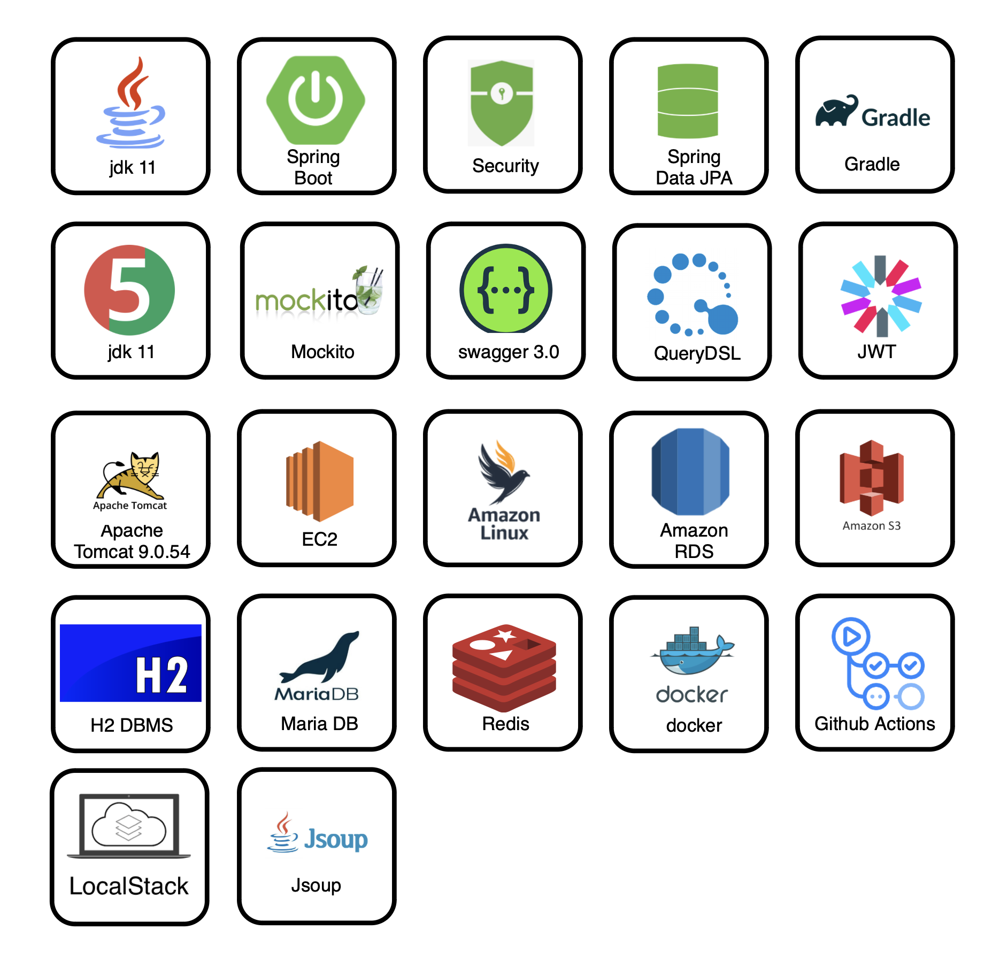
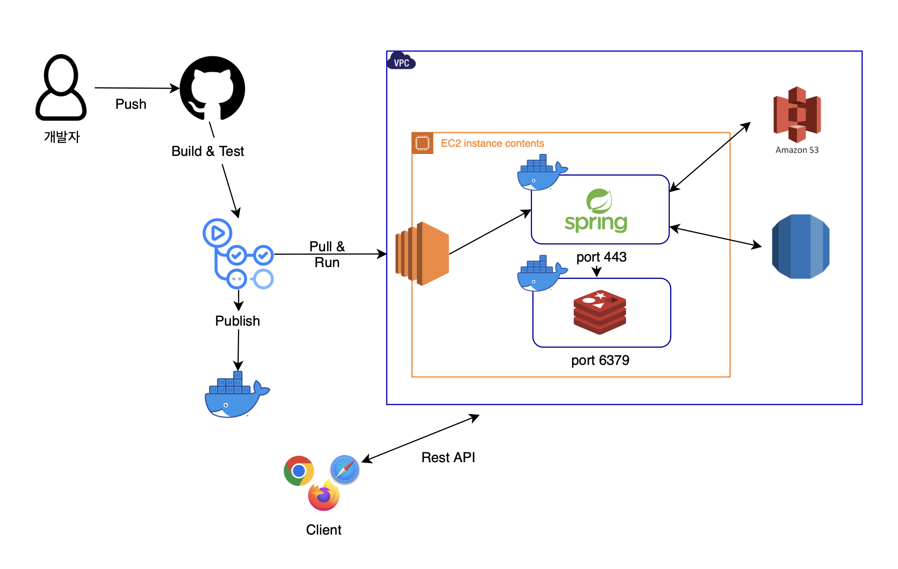
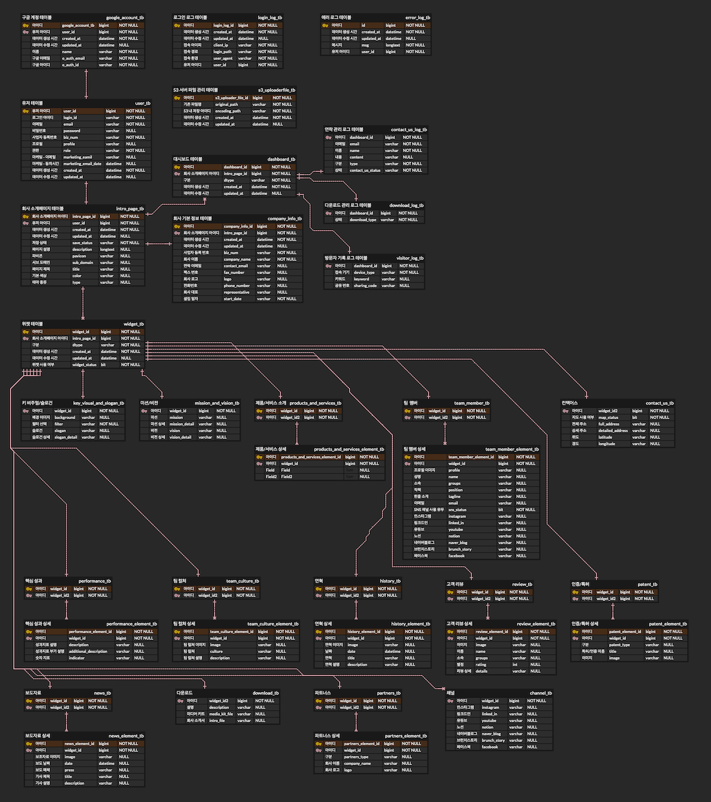

# 📢TEAM INTRO📢
## TEAM INTRO?
### 원하는 위젯을 선택하세요.
내 마음대로 회사 소개 페이지를 구상하고 원하는 위젯을 선택하여 추가가 가능합니다.
### 위젯의 순서를 변경해 보세요.
웨젯을 선택하고 내용을 추가 하였다면 순서를 변경할 수 있습니다.
### 회사 소개페이지를 게시해 보세요.
위젯을 선택하고 추가하여 저장하기 까지 하였다면 서브 도메인을 등록하여 개시하기를 통해 회사 소개 페이지를 만들 수 있습니다.
### 대시보드에서 기록을 확인해 보세요.
대시보드에서 연락관리, 다운로드 관리, 방문자 기록을 확인할 수 있습니다.

## 👩🏻‍💻참여
* 김태헌 (팀장)
* 김재완
* 김도현

## 기술 스택

## 협업 도구
* Git
* GitHub
* Slack
* Notion
* Trello
* Figma

## 시스템 아키텍쳐 설계

## ERD (v1)

